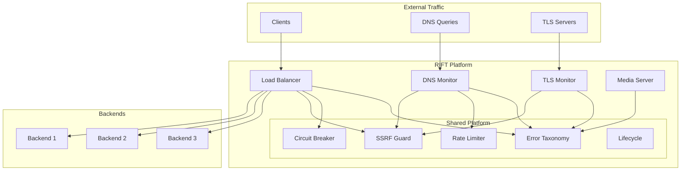

<div align="center">

# 🌐 RIFT

### Robust Infrastructure For Traffic Management

[](https://go.dev/)
[](LICENSE)
[](https://github.com/abhrajyoti-01/rift)
[](CONTRIBUTING.md)

**Rift is a Go networking toolkit for mission-critical infrastructure**

[Features](#-features) • [Quick Start](#-quick-start) • [Documentation](#-documentation) • [Architecture](#-architecture) • [Contributing](#-contributing)

---

</div>

## 📖 Table of Contents

- [Overview](#-overview)
- [Key Features](#-key-features)
- [Installation](#-installation)
- [Quick Start](#-quick-start)
- [Architecture](#-architecture)
- [Project Structure](#-project-structure)
- [Configuration](#-configuration)
- [Usage Examples](#-usage-examples)
- [Security](#-security)
- [Performance](#-performance)
- [Monitoring](#-monitoring)
- [Development](#-development)
- [Testing](#-testing)
- [Deployment](#-deployment)
- [Contributing](#-contributing)
- [License](#-license)

---

## 🎯 Overview

**RIFT** is a comprehensive networking toolkit designed for building reliable, secure, and high-performance infrastructure services. It combines DNS monitoring, load balancing, TLS inspection, and media delivery into a unified, battle-tested platform.

### Why RIFT?

- **🛡️ Security First**: Built-in SSRF protection, path traversal prevention, and comprehensive input validation
- **⚡ High Performance**: Zero-copy operations, connection pooling, and efficient concurrent processing
- **🔧 Production Ready**: Extensive error handling, graceful degradation, and comprehensive observability
- **📊 Observable**: Prometheus metrics, structured logging, and health check endpoints
- **🎯 Type Safe**: Leverages Go's type system for compile-time safety
- **🔌 Modular**: Use individual components or the complete suite

---

## ✨ Key Features

<table>
<tr>
<td width="50%">

### 🌐 DNS Monitoring

- **Wire Protocol Implementation**
  - Complete DNS message codec
  - EDNS0 support
  - Compression handling
  - Transaction validation

- **Intelligent Resolver**
  - Per-resolver query engines
  - UDP with TCP fallback
  - Circuit breaking
  - Configurable timeouts
  - Concurrent query support

- **Distributed Architecture**
  - Multi-node deployment
  - mTLS authentication
  - Hub aggregation
  - NDJSON streaming

</td>
<td width="50%">

### ⚖️ Load Balancing

- **Multi-Protocol Support**
  - L4: TCP/UDP forwarding
  - L7: HTTP reverse proxy
  - WebSocket support
  - Half-close handling

- **Smart Backend Selection**
  - Round-robin
  - Least connections
  - Random selection
  - Weighted algorithms (planned)

- **Health Monitoring**
  - Active HTTP checks
  - TCP connectivity tests
  - Configurable intervals
  - Rise/fall thresholds

</td>
</tr>
<tr>
<td width="50%">

### 🔒 TLS Monitoring

- **Certificate Inspection**
  - Chain validation
  - Expiration tracking
  - SANs verification
  - Finding classification

- **Protocol Analysis**
  - Version detection
  - Cipher suite inspection
  - Certificate chain capture

</td>
<td width="50%">

### 📦 Media Delivery

- **HTTP Range Support**
  - RFC 7233 compliance
  - Multi-range handling
  - Efficient serving
  - ETag support

- **Resource Management**
  - Stream admission control
  - Per-client rate limiting
  - Disk I/O optimization
  - Configurable read-ahead

</td>
</tr>
</table>

### 🧰 Platform Services

| Component | Description |
|-----------|-------------|
| **Error Taxonomy** | Structured error classification for metrics, logging, and retry decisions |
| **SSRF Guard** | Centralized outbound dial authorization with comprehensive deny-lists |
| **Circuit Breaker** | Automatic failure detection with half-open recovery |
| **Rate Limiter** | Sharded token buckets with bounded cardinality |
| **Retry Engine** | Configurable retry policies with backoff strategies |
| **Lifecycle Manager** | Ordered startup/shutdown with graceful drain |
| **Worker Pools** | Bounded executors with backpressure signaling |
| **Config Engine** | YAML-based configuration with strict validation |

---

## 🚀 Installation

### Prerequisites

| Requirement | Version | Notes |
|-------------|---------|-------|
| **Go** | 1.25.5+ | Required for building |
| **Git** | Latest | For cloning repository |
| **Linux** | Any | Recommended for production |

### Build from Source

```bash
# Clone the repository
git clone https://github.com/abhrajyoti-01/rift.git
cd rift

# Build all packages
go build ./...

# Build the CLI binary
go build -o rift ./cmd/rift

# Verify installation
./rift version
```

### Install via Go

```bash
# Install directly
go install github.com/abhrajyoti-01/rift/cmd/rift@latest

# Verify
rift version
```

---

## 🎯 Quick Start

### 1️⃣ Basic Usage

```bash
# Display version and build info
./rift version

# Initialize configuration (planned)
./rift init

# Validate configuration (planned)
./rift config validate rift.yaml

# Start load balancer (planned)
./rift lb --config rift.yaml
```

### 2️⃣ Development Setup

```bash
# Clone and navigate
git clone https://github.com/abhrajyoti-01/rift.git
cd rift

# Run static analysis
go vet ./...

# Format code
gofmt -w internal cmd

# Build everything
go build ./...
```

---

## 🏗️ Architecture

RIFT follows a modular architecture with clear separation of concerns:



### Design Principles

| Principle | Implementation |
|-----------|----------------|
| **Fail-Safe Defaults** | Secure by default, opt-in for permissive modes |
| **Explicit over Implicit** | No magic behavior, clear error messages |
| **Bounded Operations** | Hard limits on all buffers and queues |
| **Observable Failures** | Every error path is instrumented |
| **Defense in Depth** | Multiple validation layers |

---

## 📁 Project Structure

```
rift/
│
├── cmd/
│   └── rift/                      # CLI entry point
│       └── main.go                # Command dispatch
│
├── internal/
│   │
│   ├── platform/                  # Shared infrastructure
│   │   ├── errs/                  # Error classification
│   │   │   ├── errs.go            # Error taxonomy
│   │   │   └── class.go           # Error classes
│   │   │
│   │   ├── netx/                  # Network utilities
│   │   │   ├── guard.go           # SSRF protection
│   │   │   ├── listener.go        # Listener factory
│   │   │   └── denylist.go        # IP deny-lists
│   │   │
│   │   ├── circuit/               # Circuit breaker
│   │   │   └── circuit.go         # State machine
│   │   │
│   │   ├── ratelimit/             # Token bucket limiter
│   │   │   └── ratelimit.go       # Sharded implementation
│   │   │
│   │   ├── retry/                 # Retry policies
│   │   │   └── retry.go           # Backoff strategies
│   │   │
│   │   ├── pool/                  # Worker pools
│   │   │   └── pool.go            # Bounded executors
│   │   │
│   │   ├── lifecycle/             # Service lifecycle
│   │   │   └── lifecycle.go       # Startup/shutdown
│   │   │
│   │   ├── config/                # Configuration
│   │   │   ├── config.go          # YAML loader
│   │   │   └── validate.go        # Validation logic
│   │   │
│   │   ├── logging/               # Structured logging
│   │   ├── metrics/               # Prometheus metrics
│   │   └── health/                # Health checks
│   │
│   ├── dnsmon/                    # DNS monitoring
│   │   ├── wire/                  # DNS protocol
│   │   │   ├── encode.go          # Message encoding
│   │   │   ├── decode.go          # Message decoding
│   │   │   └── types.go           # DNS types
│   │   │
│   │   ├── resolver/              # Query engine
│   │   │   └── resolver.go        # UDP/TCP resolver
│   │   │
│   │   ├── node/                  # Monitor node
│   │   │   └── node.go            # Observation collector
│   │   │
│   │   ├── hub/                   # Aggregation hub
│   │   │   └── hub.go             # mTLS ingest
│   │   │
│   │   ├── probe/                 # DNS prober
│   │   └── model/                 # Data contracts
│   │
│   ├── lb/                        # Load balancer
│   │   ├── l4/                    # TCP/UDP forwarding
│   │   │   └── l4.go              # Connection proxy
│   │   │
│   │   ├── l7/                    # HTTP proxy
│   │   │   └── l7.go              # Reverse proxy
│   │   │
│   │   ├── picker/                # Backend selection
│   │   │   └── picker.go          # Algorithms
│   │   │
│   │   ├── health/                # Health checks
│   │   │   └── health.go          # Active probes
│   │   │
│   │   ├── control/               # Control plane
│   │   │   └── control.go         # Admin API
│   │   │
│   │   └── model/                 # Data models
│   │
│   ├── tlsmon/                    # TLS monitoring
│   │   ├── probe/                 # TLS inspector
│   │   └── model/                 # Certificate models
│   │
│   ├── media/                     # Media server
│   │   ├── server/                # HTTP server
│   │   └── model/                 # Range specs
│   │
│   └── bench/                     # Benchmarking
│       ├── loadgen/               # Load generator
│       ├── harness/               # Test harness
│       └── env/                   # Environment detection
│
├── scripts/                       # Helper scripts
│   ├── e2ebackend/                # Test backend
│   └── makefixture/               # Fixture generator
│
├── go.mod                         # Go module definition
├── go.sum                         # Dependency checksums
└── README.md                      # This file
```

---

## ⚙️ Configuration

RIFT uses YAML for configuration with strict validation:

### Example Configuration

```yaml
observability:
  admin_addr: "127.0.0.1:9000"
  admin_token_file: "/etc/rift/admin.token"
  metrics_path: "/metrics"
  pprof: false

dns:
  role: node
  node_id: "prod-node-01"
  location: "us-east-1"
  
  hub:
    url: "https://hub.example.com:9001"
    client_cert_file: "/etc/rift/client.crt"
    client_key_file: "/etc/rift/client.key"
    ca_cert_file: "/etc/rift/ca.crt"
  
  resolvers:
    - addr: "1.1.1.1:53"
      timeout: 2s
      max_conns: 10
    - addr: "8.8.8.8:53"
      timeout: 2s
      max_conns: 10
  
  targets:
    - name: "example.com."
      type: A
    - name: "example.com."
      type: AAAA
  
  interval: 60s
  ring_cap: 65536
  ship_every: 5s
  spool_dir: "/var/spool/rift"
  spool_max: 64MiB

lb:
  pools:
    - id: "api-pool"
      backends:
        - addr: "10.0.1.10:8080"
          weight: 100
        - addr: "10.0.1.11:8080"
          weight: 100
      
      health:
        method: GET
        path: /health
        timeout: 2s
        interval: 5s
        rise: 2
        fall: 3
      
      selection: least-connections
  
  listeners:
    - bind: "0.0.0.0:80"
      protocol: http
      pool_id: "api-pool"
```

### Configuration Validation

```bash
# Validate configuration
./rift config validate rift.yaml

# Dump parsed configuration (planned)
./rift config show rift.yaml

# Check configuration diff (planned)
./rift config diff old.yaml new.yaml
```

---

## 💻 Usage Examples

### DNS Monitoring

```go
import (
    "github.com/abhrajyoti-01/rift/internal/dnsmon/resolver"
    "github.com/abhrajyoti-01/rift/internal/dnsmon/wire"
)

// Create resolver
eng := resolver.New(resolver.EngineConfig{
    Addr:     "1.1.1.1:53",
    Timeout:  2 * time.Second,
    MaxConns: 10,
})

// Query DNS
obs, err := eng.Query(ctx, "example.com.", wire.TypeA)
if err != nil {
    log.Fatal(err)
}

// Process observation
fmt.Printf("Answers: %d, RCODE: %s\n", len(obs.Answers), obs.RCODE)
```

### Load Balancer

```go
import (
    "github.com/abhrajyoti-01/rift/internal/lb/l7"
    "github.com/abhrajyoti-01/rift/internal/lb/model"
)

// Create HTTP proxy
proxy := l7.New(l7.Config{
    PoolID:      "api-pool",
    MaxBody:     10 << 20, // 10 MB
    IdleTimeout: 90 * time.Second,
}, snapshotFunc)

// Serve HTTP traffic
http.ListenAndServe(":8080", proxy.Handler())
```

### Circuit Breaker

```go
import "github.com/abhrajyoti-01/rift/internal/platform/circuit"

// Create breaker
breaker := circuit.New(circuit.Config{
    FailureThreshold:   5,
    SuccessThreshold:   2,
    RecoveryCooldown:   30 * time.Second,
}, time.Now)

// Use breaker
if !breaker.Allow() {
    return errors.New("circuit open")
}

err := doWork()
if err != nil {
    breaker.Failure()
    return err
}

breaker.Success()
```

---

## 🔐 Security

### SSRF Protection

RIFT implements comprehensive SSRF protection through `netx.Guard`:

```go
// All outbound dials go through Guard
conn, err := guard.DialContext(ctx, "tcp", "example.com:443")
```

**Protection Mechanisms:**

1. **Resolve Once**: Hostnames resolved exactly once
2. **Validate All IPs**: Every resolved address checked against deny-list
3. **Dial Literals**: Only validated literal IPs are dialed
4. **Split-Horizon Detection**: Multiple IPs = reject if any denied

**Default Deny-List:**

- Private: `10.0.0.0/8`, `172.16.0.0/12`, `192.168.0.0/16`
- Loopback: `127.0.0.0/8`, `::1/128`
- Link-Local: `169.254.0.0/16`, `fe80::/10`
- Multicast: `224.0.0.0/4`, `ff00::/8`
- Reserved: `0.0.0.0/8`, `::/128`
- CGNAT: `100.64.0.0/10`

### Path Traversal Prevention

Multiple layers of validation for file operations:

```go
// Reject absolute paths
if strings.HasPrefix(name, "/") { return error }

// Reject backslashes
if strings.Contains(name, "\\") { return error }

// Clean and check for traversal
clean := filepath.Clean(name)
if strings.Contains(clean, "../") { return error }

// Validate final path is within root
if !strings.HasPrefix(absPath, root) { return error }
```

### Request Smuggling Protection

HTTP proxy rejects ambiguous framing:

```go
// Reject CL + TE co-presence
if hasTE && hasCL {
    return http.StatusBadRequest
}
```

### Resource Limits

All operations have hard bounds:

| Resource | Limit | Behavior When Exceeded |
|----------|-------|------------------------|
| DNS Batch Size | 4096 observations | Reject request |
| HTTP Body Size | 10 MB (configurable) | 413 error |
| Worker Queue | Configurable | Return `ErrFull` |
| Rate Limit Keys | Configurable | Evict oldest (counted) |
| Concurrent Queries | Per-resolver limit | Block/timeout |

---

## ⚡ Performance

### Optimization Techniques

| Technique | Implementation | Benefit |
|-----------|----------------|---------|
| **Connection Pooling** | Reusable HTTP/DNS connections | Reduced latency |
| **Zero-Copy** | Direct buffer passing | Lower CPU usage |
| **Sharded State** | Lock-free read paths | Better concurrency |
| **Splice Support** | `ReadFrom`/`WriteTo` fast path | Kernel-space copying |
| **Buffer Pooling** | `sync.Pool` for temporary buffers | Reduced GC pressure |

### Benchmarks

```bash
# Run benchmarks
go test -bench=. -benchmem ./...

# Profile CPU
go test -cpuprofile=cpu.prof -bench=BenchmarkL7Forwarding ./internal/lb/l7

# Profile memory
go test -memprofile=mem.prof -bench=BenchmarkDNSEncode ./internal/dnsmon/wire
```

---

## 📊 Monitoring

### Prometheus Metrics

RIFT exposes comprehensive Prometheus metrics:

#### DNS Monitoring Metrics

```
# Observations collected
rift_dns_observations_total{node="prod-01"}

# Query failures
rift_dns_query_failures_total{resolver="1.1.1.1:53",class="timeout"}

# Shipping metrics
rift_dns_shipped_total{node="prod-01"}
rift_dns_ship_failures_total{node="prod-01"}
```

#### Load Balancer Metrics

```
# Request metrics
rift_lb_requests_total{pool="api-pool",code="200"}
rift_lb_request_duration_seconds{pool="api-pool"}

# Connection metrics
rift_lb_active_connections{pool="api-pool"}
rift_lb_connection_errors_total{pool="api-pool",error="dial_timeout"}

# Backend health
rift_lb_backend_up{pool="api-pool",backend="10.0.1.10:8080"}
```

#### Platform Metrics

```
# Circuit breaker
rift_circuit_state{name="resolver-1.1.1.1"}
rift_circuit_failures_total{name="resolver-1.1.1.1"}

# Rate limiter
rift_ratelimit_allowed_total
rift_ratelimit_denied_total
rift_ratelimit_keys_evicted_total
```

### Structured Logging

JSON logs with consistent schema:

```json
{
  "ts": "2026-09-16T06:30:00Z",
  "level": "info",
  "msg": "query completed",
  "svc": "dnsmon",
  "comp": "resolver",
  "rid": "req-abc123",
  "qname": "example.com.",
  "qtype": "A",
  "rcode": "NOERROR",
  "dur_ms": 12
}
```

### Health Endpoints

```bash
# Liveness (process responsive)
curl http://localhost:9000/health/live

# Readiness (service ready)
curl http://localhost:9000/health/ready

# Detailed status
curl http://localhost:9000/health/status
```

---

## 🛠️ Development

### Development Environment

```bash
# Install Go 1.25.5+
wget https://go.dev/dl/go1.25.5.linux-amd64.tar.gz
sudo tar -C /usr/local -xzf go1.25.5.linux-amd64.tar.gz

# Clone repository
git clone https://github.com/abhrajyoti-01/rift.git
cd rift

# Install dependencies
go mod download

# Build
go build ./...
```

### Code Quality

```bash
# Format code
gofmt -w internal cmd scripts

# Static analysis
go vet ./...

# Check for common issues
golangci-lint run

# Check for security issues
gosec ./...
```

### Development Workflow

1. **Create feature branch**
   ```bash
   git checkout -b feature/your-feature
   ```

2. **Make changes**
   - Follow Go conventions
   - Add package-level comments
   - Update tests

3. **Verify changes**
   ```bash
   gofmt -w .
   go vet ./...
   go build ./...
   ```

4. **Commit and push**
   ```bash
   git add .
   git commit -m "feat: add your feature"
   git push origin feature/your-feature
   ```

5. **Create pull request**

---

## 🧪 Testing

### Running Tests

```bash
# Run all tests
go test ./...

# Run with coverage
go test -cover ./...

# Generate coverage report
go test -coverprofile=coverage.out ./...
go tool cover -html=coverage.out

# Run specific package
go test ./internal/dnsmon/wire

# Run with race detector
go test -race ./...

# Verbose output
go test -v ./...
```

### Test Organization

- **Unit tests**: Test individual functions and components
- **Integration tests**: Test component interactions
- **End-to-end tests**: Test complete workflows

### Writing Tests

```go
func TestDNSEncode(t *testing.T) {
    msg := &wire.Message{
        ID:      12345,
        QR:      false,
        Opcode:  0,
        Question: wire.Question{
            Name:  "example.com.",
            Type:  wire.TypeA,
            Class: wire.ClassIN,
        },
    }
    
    buf, err := wire.Encode(msg)
    if err != nil {
        t.Fatalf("Encode failed: %v", err)
    }
    
    if len(buf) < 12 {
        t.Errorf("Encoded message too short: %d bytes", len(buf))
    }
}
```

---

## 🚢 Deployment

### Binary Deployment

```bash
# Build for Linux
GOOS=linux GOARCH=amd64 go build -o rift-linux-amd64 ./cmd/rift

# Build for Windows
GOOS=windows GOARCH=amd64 go build -o rift-windows-amd64.exe ./cmd/rift

# Build with version info
go build -ldflags="-X main.version=v1.0.0 -X main.commit=$(git rev-parse HEAD)" ./cmd/rift
```

### Systemd Service

```ini
[Unit]
Description=RIFT Network Service
After=network.target

[Service]
Type=simple
User=rift
Group=rift
ExecStart=/usr/local/bin/rift lb --config /etc/rift/rift.yaml
Restart=always
RestartSec=5s

[Install]
WantedBy=multi-user.target
```

### Docker Deployment

```dockerfile
FROM golang:1.25-alpine AS builder

WORKDIR /build
COPY . .
RUN go build -o rift ./cmd/rift

FROM alpine:latest
RUN apk --no-cache add ca-certificates
COPY --from=builder /build/rift /usr/local/bin/
ENTRYPOINT ["/usr/local/bin/rift"]
```

### Kubernetes Deployment

```yaml
apiVersion: apps/v1
kind: Deployment
metadata:
  name: rift-lb
spec:
  replicas: 3
  selector:
    matchLabels:
      app: rift-lb
  template:
    metadata:
      labels:
        app: rift-lb
    spec:
      containers:
      - name: rift
        image: rift:latest
        args: ["lb", "--config", "/config/rift.yaml"]
        ports:
        - containerPort: 8080
          name: http
        - containerPort: 9000
          name: metrics
        volumeMounts:
        - name: config
          mountPath: /config
      volumes:
      - name: config
        configMap:
          name: rift-config
```

---

## 🤝 Contributing

We welcome contributions! Please follow these guidelines:

### Code Style

- Follow standard Go conventions
- Use `gofmt` for formatting
- Write clear, concise comments
- Add tests for new features

### Pull Request Process

1. Fork the repository
2. Create a feature branch (`git checkout -b feature/amazing-feature`)
3. Commit your changes (`git commit -m 'feat: add amazing feature'`)
4. Push to the branch (`git push origin feature/amazing-feature`)
5. Open a Pull Request

### Commit Message Format

```
<type>(<scope>): <subject>

<body>

<footer>
```

**Types:**
- `feat`: New feature
- `fix`: Bug fix
- `docs`: Documentation changes
- `style`: Code style changes (formatting)
- `refactor`: Code refactoring
- `test`: Test changes
- `chore`: Build/tooling changes

**Example:**
```
feat(dns): add DNSSEC validation support

Implement DNSSEC validation for A and AAAA records.
Includes signature verification and chain of trust validation.

Closes #123
```

---

## 📄 License

This project is licensed under the **Apache License 2.0** - see the [LICENSE](LICENSE) file for details.

```
Copyright 2024-2026 RIFT Contributors

Licensed under the Apache License, Version 2.0 (the "License");
you may not use this file except in compliance with the License.
You may obtain a copy of the License at

    http://www.apache.org/licenses/LICENSE-2.0

Unless required by applicable law or agreed to in writing, software
distributed under the License is distributed on an "AS IS" BASIS,
WITHOUT WARRANTIES OR CONDITIONS OF ANY KIND, either express or implied.
See the License for the specific language governing permissions and
limitations under the License.
```

---

## 🙏 Acknowledgments

Built with these excellent open-source projects:

| Dependency | Purpose | License |
|------------|---------|---------|
| [gopkg.in/yaml.v3](https://github.com/go-yaml/yaml) | YAML configuration parsing | MIT |
| [prometheus/client_golang](https://github.com/prometheus/client_golang) | Metrics instrumentation | Apache 2.0 |
| [golang.org/x/sys](https://pkg.go.dev/golang.org/x/sys) | Low-level system interfaces | BSD-3-Clause |

Special thanks to:
- The Go team for an excellent language and standard library
- The open-source community for inspiration and best practices

---

## 📬 Contact & Support

### Get Help

- 📚 **Documentation**: [github.com/abhrajyoti-01/rift/wiki](https://github.com/abhrajyoti-01/rift/wiki)
- 🐛 **Bug Reports**: [github.com/abhrajyoti-01/rift/issues](https://github.com/abhrajyoti-01/rift/issues)
- 💬 **Discussions**: [github.com/abhrajyoti-01/rift/discussions](https://github.com/abhrajyoti-01/rift/discussions)
- 📧 **Email**: [Create an issue](https://github.com/abhrajyoti-01/rift/issues/new)

### Links

- **Repository**: [github.com/abhrajyoti-01/rift](https://github.com/abhrajyoti-01/rift)
- **Issues**: [github.com/abhrajyoti-01/rift/issues](https://github.com/abhrajyoti-01/rift/issues)
- **Releases**: [github.com/abhrajyoti-01/rift/releases](https://github.com/abhrajyoti-01/rift/releases)
- **Changelog**: [CHANGELOG.md](CHANGELOG.md)

---

<div align="center">

### ⭐ Star us on GitHub — it motivates us a lot!

**Made with ❤️ for robust network infrastructure**

[⬆ Back to Top](#-rift)

</div>
